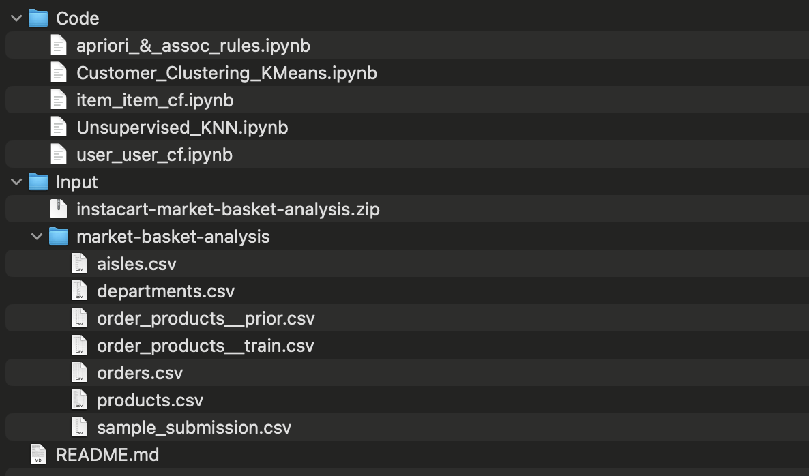

# Market Basket Analysis and Recommendation Algorithms Comparision
Market basket analysis is a type of machine learning algorithm that is used to identify relationships between items in a dataset of transactions. This algorithm is commonly used in retail and e-commerce settings to identify items that are frequently purchased together, and to make recommendations to customers based on these co-occurrences. For example, if a customer is known to frequently purchase bread and butter together, the market basket analysis algorithm may recommend other items that are commonly purchased with bread and butter, such as jam or honey. This can help retailers improve their sales and customer satisfaction by making more personalized and relevant recommendations to customers.

## Load dataset
1. Download dataset from: https://www.kaggle.com/competitions/instacart-market-basket-analysis/data  
2. Unzip  
3. The project structure should like  

## EDA
### item_item_cf.ipynb
1. Number of orders and their frequency
2. Department Tree Map along with order rate and percentage reordered
3. Most checkouts in a day

### user_user_cf.ipynb
1. Number of Orders Containing Product
2. Percentage of Orders from Aisle
3. Percentage of Orders from Department

### Customer_Clustering_KMeans.ipynb
1. Overall 20 Popular Products
2. Orders placed/User Distribution
3. Days since prior order distribution

## Algorithms Implemented
### Apriori - apriori_&_assoc_rules.ipynb
The Apriori approach employs the mining of frequently occurring itemsets and learning association rules that exist between these itemsets. As long as such item sets exist in the database frequently enough, it moves forward by detecting the frequent individual items and extending them to progressively larger item sets. It prunes away any itemsets that are not frequent by comparing them to the dataset. The frequent item sets are then used to generate association rules that highlight broad trends in the dataset. 

## Item-Item CF - item_item_cf.ipynb
Item-based collaborative filtering is a type of recommendation algorithm that uses the past interactions of users with items to make recommendations. This algorithm uses items as the basis for making recommendations, rather than users. It works by identifying similar items based on the users' past interactions with those items, and then recommending the most similar items to the user. This approach is effective because it takes into account the preferences of individual users, and can make highly personalized recommendations.

## User-User CF - user_user_cf.ipynb
User-user collaborative filtering is a recommendation system that uses similar users' preferences to make recommendations. It works by first identifying a set of users with similar preferences to the active user, then using those users' preferences to make recommendations for the active user. This is done by comparing the preferences of the active user with those of the other users in the system and identifying the users whose preferences are most similar.

## Customer Segmentation (KMeans) - Customer_Clustering_KMeans.ipynb
With the over 200k users in the dataset, It is possible to segregate users based on their purchasing habits. a retailer might use customer segmentation to divide their customers into different groups, and then use market basket analysis to identify the products that are frequently purchased by each of these groups. This can help the retailer tailor their marketing and sales efforts to better meet the needs of each customer group.

## Unsupervised KNN - Unsupervised_KNN.ipynb
Sklearn.neighbors package provides an unsupervised knn implementation which we have used to derive inference among items. Instead of processing similarities among users, we chose to find out the similarities among items across whole customer base. This way most similar ‘N’ items within their neighborhood would depict similar characteristics.